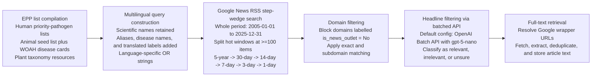

# Methodology

## Study Aim and Overall Pipeline

The repository implements a multilingual surveillance pipeline designed to identify, retrieve, and prioritise online news reporting relevant to emerging pests and pathogens (EPPs) across human, animal, and plant health domains. Methodologically, the system operationalises a One Health and planetary health perspective by treating human, livestock, wildlife, crop, and invasive-species threats as part of a shared surveillance problem, while preserving domain-specific naming resources and downstream processing rules where necessary. The end-to-end workflow comprised six linked stages: compilation of an EPP name list, generation of multilingual query strings, Google News RSS retrieval using adaptive time-window subdivision, source-domain filtering, headline-level relevance classification through batched large language model (LLM) inference, and targeted full-text retrieval for articles that passed screening.

The runtime pipeline was parameterised through a single YAML configuration file and executed separately for each domain-language dataset key (`human`, `animal`, or `plant`, crossed with English, French, Spanish, or Portuguese). By design, every stage wrote dataset-specific intermediate files, logs, and audit artefacts, thereby allowing the pipeline to be resumed without recomputing completed steps. The configured retrieval period spanned January 1, 2005, through December 31, 2025.

## Compilation of the Emerging Pest and Pathogen List

### Human and animal candidate lists

The human EPP list was assembled from curated pathogen-priority resources documented in the repository input notes and source workbooks. These sources included lists from the World Health Organization (WHO), WHO bacterial priority pathogens, WHO fungal priority pathogens, the National Institute of Allergy and Infectious Diseases (NIAID), the European Centre for Disease Prevention and Control (ECDC), Africa CDC, the US Centers for Disease Control and Prevention (CDC), and the World Organisation for Animal Health (WOAH). The repository preserves these source lineages in tracked workbooks that record organisation, list title, year, and URL, and the checked-in human search workbook contained 158 non-empty pathogen or disease rows. [The exact manual decision process by which those source lists were collapsed into the final `human_diseases_raw.xlsx` workbook is not fully recoverable from the repository beyond the tracked source sheets and workbook columns.]

The animal EPP workflow was partly automated and partly expert-curated. A 40-row seed workbook (`animal_diseases_raw.xlsx`) stored pathogen scientific names, subtype names, aliases, and disease names, together with columns indicating organisational provenance (including WOAH, NIAID, ECDC, Africa CDC, FAO, EFSA, EU4S-DEEP, and UKHSA). In parallel, a dedicated retrieval script rendered the paginated WOAH animal-disease portal, extracted 207 terrestrial and aquatic disease cards, and stored them as a structured table. A subsequent merge script combined the seed workbook with the WOAH table, used an expert-maintained mapping from WOAH disease labels to canonical pathogen scientific names, subtype labels, aliases, and disease names, and deduplicated the result to 201 cleaned animal rows. This architecture was scientifically appropriate for animal surveillance because WOAH provides authoritative disease enumeration, while the curated seed workbook preserved pathogen-level naming detail needed for targeted querying and multilingual expansion. [The exact upstream contribution of each non-WOAH animal source to the checked-in merged seed file is not fully recoverable from the repository state.]

### Plant candidate lists

Plant EPP compilation followed a distinct taxonomy-driven workflow. The checked-in raw plant workbook contained 3,199 non-empty taxonomic rows and preserved parallel taxonomic identifiers or names from EPPO, Catalogue of Life, GBIF, ITIS, NCBI, and CABI. Rather than starting from a disease-only list, the plant script established an English scientific-name anchor by selecting the first non-empty entry from `EPPO_Species`, `COL_scientificName`, `GBIF_species`, `IT IS_scientificName`, and `NCBI_ScientificName`, in that order. English aliases were then assembled from ITIS and NCBI common-name fields, lower-cased, deduplicated, and carried forward for multilingual expansion.

This choice of source databases was methodologically well suited to plant surveillance. EPPO contributed curated phytosanitary naming and multilingual common names for taxa with an EPPO identifier; Catalogue of Life, GBIF, ITIS, NCBI, and CABI provided cross-taxonomic redundancy for scientific naming, thereby reducing dependence on any single authority and allowing the pipeline to preserve alternative or revised taxonomic usages. The use of multiple taxonomic backbones is especially important for plant pests and pathogens, where synonymy, reclassification, and differing treatment of host-associated forms are common.

The repository also contains narrower, rule-based plant-filter workbooks documenting explicit exclusion reasons such as missing English common names and non-agricultural relevance. However, the active runtime configuration points to the broader `plant_diseases.xlsx` workbook rather than those reduced lists. [Accordingly, the exact plant inclusion subset used in any given analysis depends on which input workbook was supplied at runtime; the default checked-in configuration uses the broader taxonomic workbook.]

### Taxonomic harmonisation, synonym handling, and multilingual name generation

Human and animal name expansion was implemented through a shared R helper that standardised whitespace, split compound fields using column-specific rules, and removed duplicate terms case-insensitively. Scientific pathogen names and subtype names were treated as the stable taxonomic backbone. English alias fields and disease names were split on newlines or commas, normalised, and appended to the candidate pool. For plant taxa, Latin scientific names were retained in every language-specific query string, ensuring a language-stable anchor even when vernacular names were unavailable.

Two complementary external knowledge sources were then used for harmonisation. First, pathogen scientific names were resolved against NCBI taxonomy through the `taxize` R interface, which was used to obtain an NCBI taxon identifier and any available English common names. This was a scientifically defensible choice because NCBI provides a stable taxonomic anchor for pathogens and is particularly useful where common names are sparse or inconsistent. Second, both pathogens and diseases were mapped to Wikidata entities by searching English candidate terms and scoring hits according to exact label match, exact alias or match-text match, partial label overlap, and whether the Wikidata description resembled a pathogen or disease concept. Only entities clearing a minimum relevance score were retained. Labels and aliases were then extracted in English, Spanish, French, Portuguese, and the multilingual (`mul`) namespace.

For plant taxa, multilingual vernacular names were preferentially retrieved from the EPPO Global Database by scraping the curated common-name table associated with each `EPPO_taxonID`. EPPO language labels were mapped to the four pipeline languages (English, Spanish, French, and Portuguese), and Wikidata served as a fallback when EPPO lacked a taxon anchor or lacked names in a target language. This EPPO-first strategy is scientifically justified because EPPO curates pest and pathogen names in a phytosanitary context, making it more domain-specific than a general-purpose knowledge graph, while Wikidata broadens coverage for under-represented taxa and languages.

Language coverage was fixed a priori to English, Spanish, French, and Portuguese in both the code and configuration. For each row, one language-specific search string was constructed by quoting every unique term and joining terms with the Boolean operator `OR`. Search strings therefore incorporated pathogen scientific names, subtype names, English aliases, taxonomic common names, disease names, and target-language labels or aliases. When a target-language synonym set was missing, the implementation explicitly fell back to English terms rather than dropping the concept. No host terms, symptom modifiers, or contextual keywords were appended beyond the pathogen and disease naming fields contained in the workbooks. This multilingual naming strategy balanced recall and specificity: Latin scientific names preserved taxonomic precision, whereas vernacular and translated disease terms improved retrieval of routine news coverage that would not use formal taxonomy.

## Google News RSS Search Strategy and Step-Wedge Retrieval

For each domain-language dataset, the pipeline loaded the corresponding search workbook and preferentially used the language-specific query column (`search_string_en`, `search_string_fr`, `search_string_es`, or `search_string_pt`). If a language-specific column was absent, the code fell back to `search_string` and then `search_string_en`. Queries were submitted to Google News RSS through a custom subclass of `pygooglenews`, which constructed feed URLs by appending the search string and date constraints, then adding Google News locale parameters derived from a configured language-country pair.

The search design incorporated both linguistic and geographic variation. English retrieval was run separately against US, UK, and Canadian editions; French against French, Canadian, and Belgian editions; Spanish against Spanish, Mexican, and Argentine editions; and Portuguese against Brazilian and Portuguese editions. Each locale defined the Google News `lang` and `country` parameters and a tailored `Accept-Language` header. This strategy was appropriate for multilingual surveillance because news availability and ranking in Google News are partly edition-specific: running multiple country editions within a language family increases exposure to geographically local reporting while avoiding wholesale translation of the pathogen list into a much larger set of regional lexical variants.

Operationally, each search string began with a single whole-period retrieval window covering January 1, 2005, to December 31, 2025. Date-bounded Google queries were implemented by adding `after:` and `before:` operators to the RSS search URL; the nominal inclusive end date of each window was converted internally to an exclusive upper bound by querying the day after the specified window end. Retrieved RSS payloads were cached on disk as JSON, with one manifest row per search string, locale, and date window.

The repository implemented what is most accurately described as a staged, adaptive step-wedge retrieval strategy. If a window returned fewer than 100 RSS items, the window was accepted as complete and parsed directly. If a window returned 100 items or more, the pipeline treated that count as a saturation signal and subdivided the window rather than accepting the feed at face value. Whole-period windows meeting this threshold were first split into coarse 5-year periods. Any 5-year or child window that remained at or above the threshold was then recursively subdivided into progressively finer windows of 30, 14, 7, 3, and finally 1 day. Processing was breadth-first by stage rank, so all broader windows were evaluated before finer windows were launched.

This step-wedge strategy was scientifically and operationally justified because it concentrated computational effort where the feed appeared dense, while leaving sparse periods intact. [Inference from implementation: the 100-item threshold functions as a proxy for possible RSS saturation or truncation, so recursive subdivision was used to improve temporal recall without forcing all queries into daily retrieval.] The staged design also reduced redundancy: only “hot” windows were split, and parent windows marked as `split` were retained for auditability but excluded from the final aggregated RSS corpus.

After parsing cached feed payloads, the pipeline normalised publication dates to UTC, stripped HTML from RSS summaries, and generated a stable `record_id` hash from the dataset key, search string, date window, redirect URL, GUID, title, and publication timestamp. RSS records were then deduplicated in three passes: duplicate Google redirect URLs were removed first, then duplicate GUIDs, and finally duplicate title-publication pairs. This ordering favoured canonical link identity where available while still suppressing residual duplicates from overlapping locales or child windows.

Google News RSS was an appropriate source for this stage because it offers structured, machine-readable metadata, supports language and country editions, and is broad enough to capture formal news coverage, wire stories, and some institutional reporting without requiring direct site-by-site indexing. Its limitations are addressed below.

## Staged Filtering of Retrieved Items

### Domain filtering

The first filtering stage was deterministic and operated at the source-domain level. The pipeline extracted or reconstructed the `source_domain` field from the RSS metadata and compared each domain against `data/domains_removed.csv`. Any domain whose `is_news_outlet` label equalled `No` was removed, with blocking applied to both exact domains and their subdomains. Dataset-specific metrics were written for the number of RSS rows entering the filter, removed by domain blocking, and retained for the next stage.

This stage was designed to eliminate persistent non-news or low-yield sources before any model inference was attempted. The checked-in runtime code does not regenerate the domain labels; it consumes the static CSV as a source-of-truth blocklist. [The exact procedure used to generate the checked-in blocklist is not recoverable from the current runtime code, but archived repository scripts indicate that domains were screened according to whether they primarily functioned as news outlets and were consolidated across repeated model-based classification runs by majority vote.] Even in the absence of full provenance for the released CSV, the staged design is scientifically reasonable: removing clearly non-news domains upstream reduces false positives from institutional resource pages, catalogues, or reference content while preserving downstream model capacity for event-like reporting.

### Headline filtering via batched API workflows

Headline-level screening was implemented as asynchronous batch inference against a single LLM provider selected in the configuration. In the checked-in runtime configuration, the provider was OpenAI and the model was `gpt-5-nano`; the codebase also includes a compatible Anthropic backend, but only one provider is used per run. Each retained RSS item was converted into a structured request containing the pathogen domain, language, matched search string, headline, cleaned RSS summary, source name, source domain, and publication date.

The system prompt instructed the model to behave as a strict pathogen-news relevance classifier and to return JSON only, with three keys: `label`, `confidence`, and `rationale`. The allowed labels were `relevant`, `irrelevant`, and `unsure`. In paraphrased form, the decision rule defined `relevant` headlines as those clearly concerning the searched human pathogen or disease, animal pathogen or livestock or wildlife outbreak, or plant pathogen, pest, or crop disease, including reporting on outbreak occurrence, spread, surveillance, control, response, impacts, or consequences. `Irrelevant` covered homonyms, metaphors, finance, sports, entertainment, spam, or clearly different topics. `Unsure` was reserved for items that were ambiguous from the headline and RSS summary alone, and the prompt explicitly instructed the model to use conservative confidence when evidence was weak. The rationale was constrained to a very short explanation. The verbatim prompt is sufficiently stable and specific that it would be appropriate to reproduce in an appendix or supplement.

Batch preparation was designed for high-throughput, resumable execution. Pending items were chunked to respect provider caps on request count, input-file size, estimated prompt tokens per batch, estimated enqueued prompt tokens, and the number of pending batches per dataset. Native request JSONL files were written to disk for audit, each batch received a dataset-specific name, and a batch registry recorded submission time, provider, batch identifier, status, and later hydration metadata. When results became available, the pipeline downloaded raw outputs, stored them as JSONL audit files, parsed each response, and wrote a normalised headline-state table. Empty responses, invalid JSON, invalid labels, and invalid confidence fields were not silently discarded; instead, they were coerced to `unsure`, assigned a parse-error flag, and preserved in the state file.

The final action applied to each headline was deterministic: `relevant` mapped to `keep`, `irrelevant` to `drop`, and `unsure` to `review`. This staged use of batched LLM inference was methodologically appropriate for three reasons. First, it preserved scalability by screening many items without immediately downloading full articles. Second, it aligned the model with the real information available at this stage of discovery, namely the headline and RSS summary rather than the full text. Third, the explicit `unsure` category provided a mechanism for retaining sensitivity in ambiguous cases rather than forcing premature binary decisions. The trade-off is that event relevance is judged from limited context, which can improve specificity for obvious false matches but can miss subtle events whose salience only becomes clear in the article body.

## Full-Text Retrieval

Only rows whose `final_action` matched the configured keep action were sent to full-text retrieval. The pipeline first attempted to resolve Google News wrapper URLs to publisher URLs. It did this by decoding Google article identifiers offline when possible and, if that failed, by querying Google’s internal batchexecute endpoint; if both methods failed, the wrapper URL itself was retained as a fallback target. This resolution step was necessary because RSS links frequently point to Google wrapper URLs rather than directly to the publisher, and resolving those links improves canonicalisation, de-duplication, and publisher-side text extraction.

Resolved URLs were fetched through a single requests session using a declared user agent, exponential backoff, and a configured rate limit of 0.5 requests per second. Non-HTML responses, HTTP errors, request failures, empty extractions, and articles with fewer than 120 words were all recorded as failures with explicit status codes or reason strings rather than being silently omitted. Metadata extraction parsed canonical URLs, page titles, publication dates, language tags, authorship, and source domains from Open Graph tags, canonical links, HTML metadata, response headers, and JSON-LD article objects when available.

Main-text extraction followed a predefined fallback order. The pipeline first tried `trafilatura`, then `readability-lxml`, and finally `newspaper3k` when installed. The extracted text was normalised, hashed, and stored together with the extraction method. Successful full-text records were deduplicated at two levels: URLs were canonicalised by removing tracking parameters, normalising host and path structure, and sorting residual query parameters; then full texts were screened for duplicate URL keys and duplicate content hashes. Articles matching a previously seen canonical or final URL, or matching an existing content hash, were recorded as duplicates and not retained as new successes. Checkpoints were written after every 10 processed rows so that long runs could resume safely.

Retrieving full text after headline screening was methodologically necessary because downstream epidemiological interpretation requires more than topical mention. Headline-level relevance can identify likely event reports, but verification of outbreak context, control measures, geographic scope, sectoral consequences, and temporal sequence depends on the article body. The full-text layer therefore served as the transition from discovery to analytically usable surveillance records.

## Quality Assurance, Reproducibility, and Implementation Considerations

Several implementation features in the repository were explicitly reproducibility-oriented. Stage logic was modularised into separate retrieval, classification, and extraction scripts; runtime behaviour was centralised in a YAML configuration file; sensitive credentials were resolved from `.env`; and output paths were standardised by dataset key. Atomic writes were used for CSV, Parquet, and JSON outputs to reduce corruption risk. Logging was performed at dataset level for the overall pipeline and for individual stages, including RSS retrieval, domain filtering, headline filtering, and full-text retrieval.

The pipeline was also designed to be restartable. RSS retrieval stored every requested window in a manifest with statuses such as `pending`, `success`, `empty`, `split`, `throttled`, and `failed`, together with cached payload locations, retry timestamps, and elapsed request time. Headline filtering maintained both a state table for individual records and a registry for submitted batches. Full-text retrieval reused previously successful records when they still satisfied the configured minimum word count and content-hash requirements, and it preserved failed-record logs separately. These design decisions support transparent auditing and incremental reruns rather than one-off extraction.

Validation and cleaning steps were embedded throughout the pipeline. Input workbooks were checked for required columns before multilingual enrichment. RSS outputs were normalised and deduplicated before filtering. Model outputs were parsed conservatively, with malformed responses demoted to `unsure`. Full-text records were accepted only when extraction yielded HTML-derived article text above a minimum length threshold. Within-run caches were used for NCBI and Wikidata lookups so repeated entity resolution did not yield inconsistent row-level results.

The repository nevertheless exposes important methodological limitations. First, Google News RSS is not an exhaustive archive, and its coverage is likely to vary over time, by locale, and in response to ranking or product changes. Throttling and consent pages were anticipated in code, but these remain an operational risk for large-scale retrieval. Second, multilingual query expansion depends on heuristic entity matching in Wikidata and on uneven language coverage in EPPO and NCBI common-name resources; some target-language search strings therefore remain dominated by English or Latin terms. Third, source-domain filtering depends on a static blocklist whose current provenance is only partly recoverable from the repository. Fourth, headline-only model screening may sacrifice sensitivity for nuanced or context-dependent events. Finally, the plant and animal input artefacts in the repository reflect an evolving curation workflow: the checked-in animal workbook is not fully synchronised with the current multilingual enrichment script, and multiple plant workbooks document alternative filtering regimes. [These discrepancies do not invalidate the code logic, but they mean that exact upstream input selection for a historical run is not completely reconstructable from the repository snapshot alone.]

## Ethical and Reporting Considerations

The pipeline operated exclusively on publicly accessible online content and did not involve recruitment of human participants or direct collection of personal data. The automated retrieval components incorporated a declared user agent, rate limiting, retry backoff, and on-disk caching to reduce repeated requests to publisher infrastructure. The LLM stage was used for relevance prioritisation rather than automated adjudication of individual persons or sensitive traits. From a reporting perspective, the repository supports transparent disclosure of data sources, configuration settings, intermediate artefacts, and failure modes, which is essential when combining RSS-based discovery, multilingual name expansion, and model-assisted screening in biosurveillance workflows.

## Methods Rationale Summary

| Methodological component | Scientific rationale |
| --- | --- |
| Multi-source EPP list assembly | Combining institutional priority-pathogen lists and taxonomic databases reduces dependence on any single source and improves coverage across human, animal, and plant health threats. |
| Scientific-name anchors with multilingual alias expansion | Latin scientific names preserve taxonomic precision, while vernacular and translated terms improve retrieval of routine reporting that would not use formal nomenclature. |
| EPPO-first plant naming with Wikidata fallback | EPPO contributes phytosanitary, taxon-specific common names, whereas Wikidata broadens multilingual coverage for taxa or languages missing from EPPO. |
| Multi-locale Google News RSS querying | Separate country editions within each language family increase geographic coverage of news discovery without requiring uncontrolled query proliferation. |
| Adaptive step-wedge window subdivision | Splitting only high-yield windows concentrates effort where feeds appear saturated, improving temporal recall while limiting redundant retrieval of sparse periods. |
| Domain filtering before LLM screening | Removing clearly non-news or low-yield sources upstream reduces false positives and conserves model capacity for surveillance-relevant reporting. |
| Batched headline-level LLM classification with an `unsure` class | Batch inference scales screening while preserving ambiguous cases for review rather than forcing premature binary decisions from limited context. |
| Full-text retrieval after relevance screening | Article bodies are required to verify outbreak context, interventions, and sectoral consequences that cannot be assessed reliably from headlines alone. |
| Audit trails, manifests, batch registries, and checkpoints | Persistent intermediate state enables reruns, failure diagnosis, and transparent reconstruction of the surveillance corpus. |

## Figure 1. Workflow of the multilingual EPP news-retrieval pipeline

**Legend.** Candidate EPP names were first assembled and harmonised across human, animal, and plant health resources. Language-specific Boolean query strings were then generated and submitted to Google News RSS across multiple locale editions. Retrieved feed items underwent deterministic source-domain filtering, batch LLM headline screening, and finally targeted full-text retrieval for records retained as surveillance-relevant.

